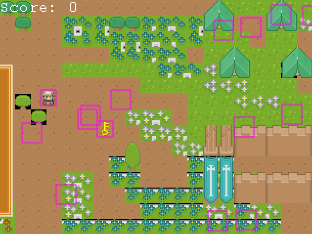

# TheQuest, Simple RPG game.

> The Quest it's a simple RPG game based on Phaser 3 JS Library to build and animate a variety of games.  In "The Quest" your character it's a hired freelance warrior hunting a warlord "BigBoss" Dragon Conjurer. To find him and destroy him, The warrior must fight a host of dragons hidden in the ruins of a ancient city, in the road he will find hidden treasures before the final battle with BigBoss.

## Built With

- HTML
- CSS
- Javascript
- Phaser 3
- Score API

## Live Demo

[HowsTheWeather]()

## How to install

First, please install node in your system [Node install instruction](https://nodejs.org/en/download/package-manager/)

Clone this repository, you can download it as a zip file if you prefer.

Run:  npm install on your terminal to install all the dependencies.

Open the index.html file in the public\dist folder.

## How to play

The controls are very simple. You move your character using the arrow keys while moving around the map. Once you engage in a battle with some enemy, you will use the arrow keys to choose the attack, the target, and the SPACE BAR to comfirm the attack.

Enjoy!

## Authors

👤 Carlos Prieto Barron

- Github: [@carlosprietobarron](https://github.com/carlosprietobarron)

## 🤝 Contributing

Contributions, issues and feature requests are welcome!

Feel free to check the [issues page](issues/).

## Show your support

Give a ⭐️ if you like this project!

## Acknowledgments

- Hat tip to anyone whose code was used
- Inspiration
- etc

## 📝 License

This project is [MIT](lic.url) licensed.

